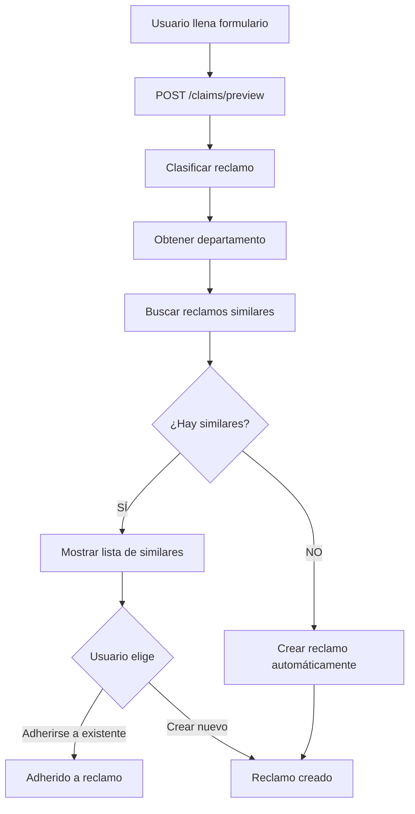
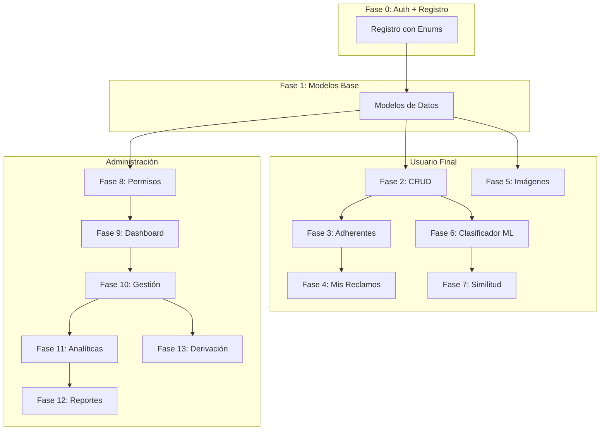
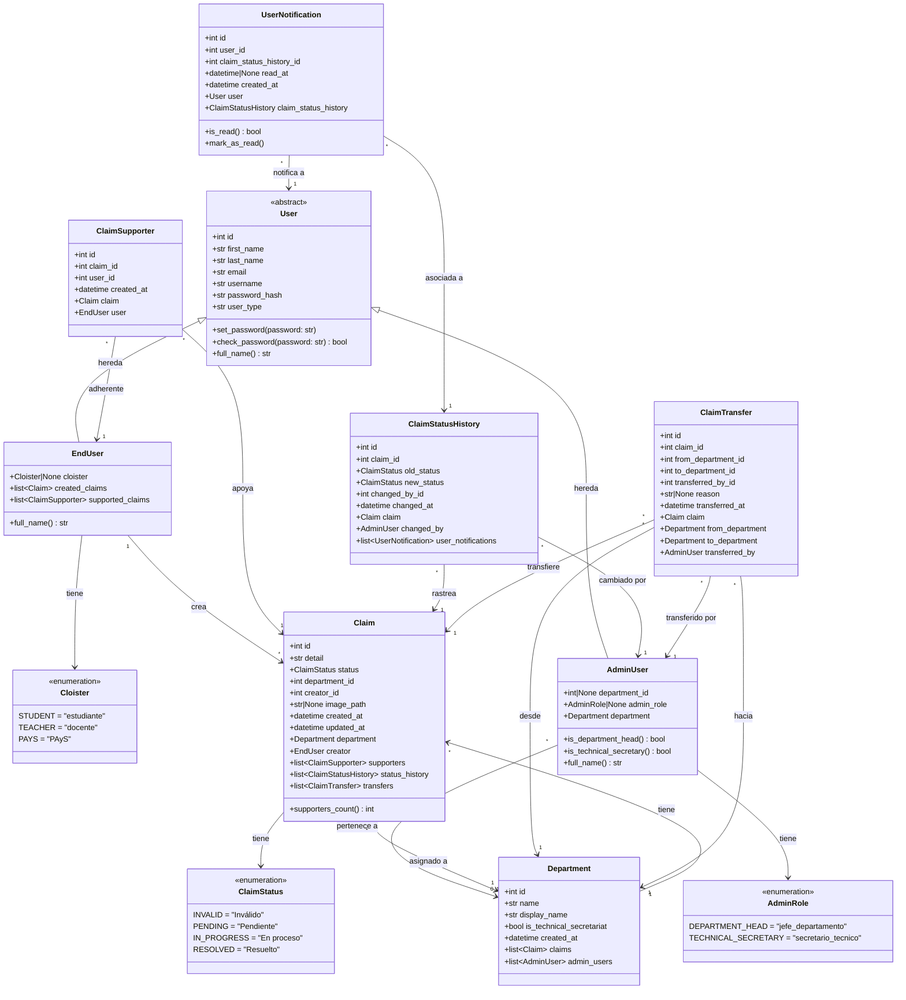

# Guía de Implementación - Sistema de Reclamos

Este documento detalla el plan de implementación paso a paso para el sistema de reclamos. Las funcionalidades están ordenadas de menor a mayor complejidad, con las dependencias claramente identificadas.

---

## Tabla de Contenidos

### Parte 0: Base del Sistema
0. [Fase 0: Registro y Autenticación de Usuarios](#fase-0-registro-y-autenticación-de-usuarios)

### Parte 1: Funcionalidades de Usuario Final
1. [Fase 1: Modelo de Datos de Reclamos](#fase-1-modelo-de-datos-de-reclamos)
2. [Fase 2: CRUD Básico de Reclamos](#fase-2-crud-básico-de-reclamos)
3. [Fase 3: Sistema de Adherentes](#fase-3-sistema-de-adherentes)
4. [Fase 4: Mis Reclamos y Notificaciones](#fase-4-mis-reclamos-y-notificaciones)
5. [Fase 5: Carga de Imágenes](#fase-5-carga-de-imágenes)
6. [Fase 6: Clasificador Automático](#fase-6-clasificador-automático)
7. [Fase 7: Detección de Reclamos Similares](#fase-7-detección-de-reclamos-similares)

### Parte 2: Funcionalidades de Administración
8. [Fase 8: Sistema de Roles y Permisos](#fase-8-sistema-de-roles-y-permisos)
9. [Fase 9: Dashboard de Departamentos](#fase-9-dashboard-de-departamentos)
10. [Fase 10: Gestión de Reclamos (Admin)](#fase-10-gestión-de-reclamos-admin)
11. [Fase 11: Analíticas y Estadísticas](#fase-11-analíticas-y-estadísticas)
12. [Fase 12: Generación de Reportes](#fase-12-generación-de-reportes)
13. [Fase 13: Derivación de Reclamos](#fase-13-derivación-de-reclamos)

---

## Fase 0: Registro y Autenticación de Usuarios

### Objetivo
Implementar dos tipos de usuarios separados usando herencia de SQLAlchemy:
- **EndUser**: Usuarios finales que crean y adhieren a reclamos (tienen claustro)
- **AdminUser**: Usuarios administrativos que gestionan reclamos (tienen departamento y rol admin)

### 0.1 Arquitectura de Herencia (Single Table Inheritance)

Se usa **Single Table Inheritance** de SQLAlchemy para tener una tabla `user` con una columna discriminadora `user_type` que diferencia entre tipos de usuario.

```
┌─────────────────────────────────────────────────────────────┐
│                         User (Base)                          │
│  - id, first_name, last_name, email, username, password_hash │
│  - user_type (discriminador: 'end_user' | 'admin_user')      │
├─────────────────────────────┬───────────────────────────────┤
│         EndUser             │          AdminUser            │
│  - cloister (enum)          │  - department_id (int)        │
│                             │  - admin_role (enum)          │
└─────────────────────────────┴───────────────────────────────┘
```

### 0.2 Enums del Sistema

```python
# app/models/user.py
from enum import Enum


class Cloister(Enum):
    """Claustro al que pertenece un usuario final"""
    STUDENT = "estudiante"
    TEACHER = "docente"
    PAYS = "PAyS"  # Personal de Apoyo y Servicios


class AdminRole(Enum):
    """Rol de un usuario administrativo"""
    DEPARTMENT_HEAD = "jefe_departamento"    # Jefe de un departamento específico
    TECHNICAL_SECRETARY = "secretario_tecnico"  # Acceso a secretaría técnica
```

### 0.3 Modelo Base `User`

```python
# app/models/user.py
from sqlalchemy.orm import Mapped, mapped_column
from app.extensions import db
from werkzeug.security import generate_password_hash, check_password_hash
from flask_login import UserMixin


class User(UserMixin, db.Model):
    """Clase base abstracta para todos los usuarios"""
    __tablename__ = 'user'
    
    id: Mapped[int] = mapped_column(primary_key=True)
    first_name: Mapped[str] = mapped_column(nullable=False)
    last_name: Mapped[str] = mapped_column(nullable=False)
    email: Mapped[str] = mapped_column(unique=True, nullable=False)
    username: Mapped[str] = mapped_column(unique=True, nullable=False)
    password_hash: Mapped[str] = mapped_column(nullable=False)
    
    # Columna discriminadora para herencia
    user_type: Mapped[str] = mapped_column(nullable=False)
    
    __mapper_args__ = {
        'polymorphic_on': user_type,
        'polymorphic_identity': 'user'
    }

    def set_password(self, password: str):
        self.password_hash = generate_password_hash(password)

    def check_password(self, password: str) -> bool:
        return check_password_hash(self.password_hash, password)

    @property
    def full_name(self) -> str:
        return f"{self.first_name} {self.last_name}"

    def __repr__(self):
        return f"<{self.__class__.__name__} {self.username}>"
```

### 0.4 Modelo `EndUser` (Usuario Final)

```python
class EndUser(User):
    """Usuario final que crea y adhiere a reclamos"""
    
    cloister: Mapped[Cloister] = mapped_column(nullable=True)  # Solo para EndUser
    
    __mapper_args__ = {
        'polymorphic_identity': 'end_user'
    }

    def __init__(
        self,
        first_name: str,
        last_name: str,
        email: str,
        username: str,
        cloister: Cloister,
    ):
        self.first_name = first_name
        self.last_name = last_name
        self.email = email
        self.username = username
        self.cloister = cloister
```

### 0.5 Modelo `AdminUser` (Usuario Administrativo)

```python
class AdminUser(User):
    """Usuario administrativo que gestiona reclamos"""
    
    department_id: Mapped[int | None] = mapped_column(nullable=True)  # FK al departamento
    admin_role: Mapped[AdminRole] = mapped_column(nullable=True)  # Solo para AdminUser
    
    __mapper_args__ = {
        'polymorphic_identity': 'admin_user'
    }

    def __init__(
        self,
        first_name: str,
        last_name: str,
        email: str,
        username: str,
        admin_role: AdminRole,
        department_id: int | None = None,
    ):
        self.first_name = first_name
        self.last_name = last_name
        self.email = email
        self.username = username
        self.admin_role = admin_role
        self.department_id = department_id
    
    @property
    def is_department_head(self) -> bool:
        return self.admin_role == AdminRole.DEPARTMENT_HEAD
    
    @property
    def is_technical_secretary(self) -> bool:
        return self.admin_role == AdminRole.TECHNICAL_SECRETARY
```

### 0.6 Estructura de Archivos

```
app/
├── models/
│   └── user/
│       ├── __init__.py      # Exporta User, EndUser, AdminUser, Cloister, AdminRole
│       ├── base.py          # User base class
│       ├── end_user.py      # EndUser + Cloister enum
│       └── admin_user.py    # AdminUser + AdminRole enum
├── routes/
│   └── auth/
│       ├── __init__.py      # Blueprint padre 'auth' con nested blueprints
│       ├── end_user.py      # Rutas auth.end_user.*
│       └── admin.py         # Rutas auth.admin.*
├── services/
│   └── user_service.py
```

### 0.7 Rutas de Autenticación (Nested Blueprints)

| Ruta | Endpoint | Descripción |
|------|----------|-------------|
| `/register` | `auth.end_user.register` | Registro de usuarios finales |
| `/login` | `auth.end_user.login` | Login de usuarios finales |
| `/logout` | `auth.end_user.logout` | Cerrar sesión (ambos tipos) |
| `/admin/login` | `auth.admin.login` | Login de usuarios administrativos |
| `/admin/` | `auth.admin.dashboard` | Dashboard de administración |

### 0.8 Servicio de Usuario

```python
# app/services/user_service.py
from app.models.user import User, EndUser, AdminUser, Cloister, AdminRole
from app.extensions import db


class UserService:
    @staticmethod
    def email_exists(email: str) -> bool:
        """Verifica si el email ya está registrado"""
        return User.query.filter_by(email=email).first() is not None
    
    @staticmethod
    def username_exists(username: str) -> bool:
        """Verifica si el nombre de usuario ya está registrado"""
        return User.query.filter_by(username=username).first() is not None
    
    @staticmethod
    def register_end_user(
        first_name: str,
        last_name: str,
        email: str,
        username: str,
        cloister: Cloister,
        password: str
    ) -> tuple[EndUser | None, str | None]:
        """
        Registra un nuevo usuario final.
        Retorna (user, None) si exitoso, (None, error_message) si falla.
        """
        if UserService.email_exists(email):
            return None, "El email ya está registrado"
        
        if UserService.username_exists(username):
            return None, "El nombre de usuario ya está en uso"
        
        user = EndUser(
            first_name=first_name,
            last_name=last_name,
            email=email,
            username=username,
            cloister=cloister
        )
        user.set_password(password)
        
        db.session.add(user)
        db.session.commit()
        
        return user, None
    
    @staticmethod
    def create_admin_user(
        first_name: str,
        last_name: str,
        email: str,
        username: str,
        admin_role: AdminRole,
        password: str,
        department_id: int | None = None
    ) -> tuple[AdminUser | None, str | None]:
        """
        Crea un nuevo usuario administrativo (solo por scripts de sistema).
        Retorna (user, None) si exitoso, (None, error_message) si falla.
        """
        if UserService.email_exists(email):
            return None, "El email ya está registrado"
        
        if UserService.username_exists(username):
            return None, "El nombre de usuario ya está en uso"
        
        user = AdminUser(
            first_name=first_name,
            last_name=last_name,
            email=email,
            username=username,
            admin_role=admin_role,
            department_id=department_id
        )
        user.set_password(password)
        
        db.session.add(user)
        db.session.commit()
        
        return user, None
    
    @staticmethod
    def authenticate_end_user(username: str, password: str) -> EndUser | None:
        """Autentica un usuario final por username y password"""
        user = EndUser.query.filter_by(username=username).first()
        if user and user.check_password(password):
            return user
        return None
    
    @staticmethod
    def authenticate_admin_user(username: str, password: str) -> AdminUser | None:
        """Autentica un usuario administrativo por username y password"""
        user = AdminUser.query.filter_by(username=username).first()
        if user and user.check_password(password):
            return user
        return None
```

### 0.9 Rutas de Autenticación

```python
# app/routes/auth/__init__.py
from flask import Blueprint
from app.routes.auth.end_user import end_user_auth_bp
from app.routes.auth.admin import admin_auth_bp

# Blueprint padre que agrupa toda la autenticación
auth_bp = Blueprint("auth", __name__)

# Registrar blueprints hijos
auth_bp.register_blueprint(end_user_auth_bp)
auth_bp.register_blueprint(admin_auth_bp)
```

```python
# app/routes/auth/end_user.py
from flask import Blueprint, render_template, request, redirect, url_for, flash
from flask_login import login_user, logout_user, login_required
from app.services.user_service import UserService
from app.models.user import Cloister

end_user_auth_bp = Blueprint("end_user", __name__)


@end_user_auth_bp.get("/register")
def register():
    return render_template("auth/register.html")


@end_user_auth_bp.post("/register")
def register_post():
    # ... validación y registro ...
    flash("Usuario registrado exitosamente.", "success")
    return redirect(url_for("auth.end_user.login"))


@end_user_auth_bp.get("/login")
def login():
    return render_template("auth/login.html")


@end_user_auth_bp.post("/login")
def login_post():
    username = request.form["username"]
    password = request.form["password"]
    
    user = UserService.authenticate_end_user(username, password)
    
    if user:
        login_user(user)
        return redirect(url_for("main.index"))
    
    flash("Usuario o contraseña incorrectos.", "error")
    return redirect(url_for("auth.end_user.login"))


@end_user_auth_bp.post("/logout")
@login_required
def logout():
    logout_user()
    return redirect(url_for("main.index"))
```

```python
# app/routes/auth/admin.py  (solo autenticación admin)
from flask import Blueprint, render_template, request, redirect, url_for, flash
from flask_login import login_user, current_user
from app.services.user_service import UserService
from app.models.user import AdminUser

admin_auth_bp = Blueprint("admin", __name__, url_prefix="/admin")


@admin_auth_bp.get("/login")
def login():
    if current_user.is_authenticated and isinstance(current_user, AdminUser):
        return redirect(url_for("admin.dashboard"))
    return render_template("admin/login.html")


@admin_auth_bp.post("/login")
def login_post():
    username = request.form["username"]
    password = request.form["password"]
    
    user = UserService.authenticate_admin_user(username, password)
    
    if user:
        login_user(user)
        return redirect(url_for("admin.dashboard"))
    
    flash("Usuario o contraseña incorrectos", "error")
    return redirect(url_for("auth.admin.login"))


# app/routes/admin.py  (panel de administración)
# Define rutas como /admin/ (dashboard), /admin/help y /admin/claims
```

### 0.10 Templates

#### Template de Login de Usuario Final
```html
<!-- app/templates/auth/login.html -->



<h1>Iniciar Sesión</h1>

<form method="POST" action="{{ url_for('auth.end_user.login') }}">
    <div class="form-group">
        <label for="username">Nombre de usuario</label>
        <input type="text" name="username" id="username" required>
    </div>
    
    <div class="form-group">
        <label for="password">Contraseña</label>
        <input type="password" name="password" id="password" required>
    </div>
    
    <button type="submit">Iniciar sesión</button>
</form>

<p>¿No tienes cuenta? <a href="{{ url_for('auth.end_user.register') }}">Registrarse</a></p>

```

#### Template de Login de Administrador
```html
<!-- app/templates/admin/login.html -->



<h1>Panel de Administración</h1>
<h2>Iniciar Sesión</h2>

<form method="POST" action="{{ url_for('auth.admin.login') }}">
    <div class="form-group">
        <label for="username">Nombre de usuario</label>
        <input type="text" name="username" id="username" required>
    </div>
    
    <div class="form-group">
        <label for="password">Contraseña</label>
        <input type="password" name="password" id="password" required>
    </div>
    
    <button type="submit">Iniciar sesión</button>
</form>

```

### 0.11 Configuración de Flask-Login

```python
# app/__init__.py
from flask import Flask
from app.extensions import db, login_manager
from app.routes.main import main_bp
from app.routes.auth import auth_bp
from app.models.user import User


def create_app():
    app = Flask(__name__)
    # ... configuración ...
    
    login_manager.login_view = "auth.end_user.login"
    
    @login_manager.user_loader
    def load_user(user_id):
        """Carga cualquier tipo de usuario por ID"""
        return db.session.get(User, int(user_id))
    
    # Register Blueprints
    app.register_blueprint(main_bp)
    app.register_blueprint(auth_bp)
    
    return app
```

### Archivos Implementados
- [x] `app/models/user/__init__.py` - Exporta todos los modelos y enums
- [x] `app/models/user/base.py` - User base class
- [x] `app/models/user/end_user.py` - EndUser + Cloister
- [x] `app/models/user/admin_user.py` - AdminUser + AdminRole
- [x] `app/services/user_service.py` - Métodos separados para cada tipo
- [x] `app/routes/auth/__init__.py` - Blueprint padre con nested blueprints
- [x] `app/routes/auth/end_user.py` - Rutas auth.end_user.*
- [x] `app/routes/auth/admin.py` - Rutas auth.admin.*
- [x] `app/templates/auth/login.html` - Login usuarios finales
- [x] `app/templates/admin/login.html` - Login administradores
- [x] `app/__init__.py` - Registrar blueprint auth

### Dependencias
- Ninguna (primera fase)

---

## Fase 1: Modelo de Datos de Reclamos

### Objetivo
Crear los modelos de base de datos necesarios para el sistema de reclamos.

### Modelos a Crear

#### 1.1 Modelo `Department` (Departamento)

> **IMPORTANTE**: Crear departamentos como modelo para permitir extensibilidad futura.

```python
# app/models/department.py
from datetime import datetime as Datetime
from sqlalchemy.orm import Mapped, mapped_column, relationship
from app.extensions import db

class Department(db.Model):
    id: Mapped[int] = mapped_column(primary_key=True)
    name: Mapped[str] = mapped_column(unique=True, nullable=False)  # Nombre interno
    display_name: Mapped[str] = mapped_column(nullable=False)       # Nombre para mostrar
    is_technical_secretariat: Mapped[bool] = mapped_column(default=False)
    created_at: Mapped[Datetime] = mapped_column(default=Datetime.now)
    
    # Relaciones
    claims = relationship('Claim', back_populates='department')
    users = relationship('User', back_populates='department')
```

**Departamentos iniciales a crear:**
1. Departamento específico 1 (ej: "Mantenimiento")
2. Departamento específico 2 (ej: "Infraestructura") 
3. Secretaría Técnica (con `is_technical_secretariat=True`)

> **NOTA**: El modelo `User` ya incluye `role` y `department_id` desde la Fase 0.

#### 1.2 Modelo `Claim` (Reclamo)

```python
# app/models/claim.py
class ClaimStatus(Enum):
    INVALID = "Inválido"
    PENDING = "Pendiente"
    IN_PROGRESS = "En proceso"
    RESOLVED = "Resuelto"

class Claim(db.Model):
    id: Mapped[int]                    # Número de identificación
    detail: Mapped[str]                # Detalle del problema
    status: Mapped[ClaimStatus]        # Estado del reclamo
    department_id: Mapped[int]         # FK al departamento (en lugar de string)
    created_at: Mapped[Datetime]       # Timestamp de creación
    updated_at: Mapped[Datetime]       # Timestamp de última actualización
    image_path: Mapped[str | None]     # Ruta de imagen (opcional)
    creator_id: Mapped[int]            # FK al usuario creador
```

#### 1.3 Modelo `ClaimSupporter` (Adherente)

```python
# app/models/claim_supporter.py
class ClaimSupporter(db.Model):
    id: Mapped[int]
    claim_id: Mapped[int]              # FK al reclamo
    user_id: Mapped[int]               # FK al usuario adherente
    created_at: Mapped[Datetime]       # Cuándo se adhirió
```

#### 1.4 Modelo `ClaimStatusHistory` (Historial de Estados)

```python
# app/models/claim_status_history.py
class ClaimStatusHistory(db.Model):
    id: Mapped[int]
    claim_id: Mapped[int]              # FK al reclamo
    old_status: Mapped[ClaimStatus]    # Estado anterior
    new_status: Mapped[ClaimStatus]    # Estado nuevo
    changed_by_id: Mapped[int]         # FK al usuario que cambió el estado
    changed_at: Mapped[Datetime]       # Cuándo cambió
    notified: Mapped[bool]             # Si ya se notificó al usuario
```

#### 1.5 Modelo `ClaimTransfer` (Derivación de Reclamos)

> **IMPORTANTE**: Para rastrear cuando secretaría técnica deriva un reclamo.

```python
# app/models/claim_transfer.py
class ClaimTransfer(db.Model):
    id: Mapped[int]
    claim_id: Mapped[int]              # FK al reclamo
    from_department_id: Mapped[int]    # Departamento origen
    to_department_id: Mapped[int]      # Departamento destino
    transferred_by_id: Mapped[int]     # FK al usuario que derivó
    reason: Mapped[str | None]         # Motivo de la derivación (opcional)
    transferred_at: Mapped[Datetime]   # Cuándo se derivó
```

### Archivos Implementados
- [x] `app/models/department.py`
- [x] `app/models/claim.py`
- [x] `app/models/claim_supporter.py`
- [x] `app/models/claim_status_history.py`
- [x] `app/models/claim_transfer.py`
- [x] `app/models/__init__.py` (exporta todos los modelos y enums)
- [x] `app/models/user/end_user.py` (actualizado con relaciones a reclamos)
- [x] `app/models/user/admin_user.py` (actualizado con FK a Department)
- [x] `seed_db.py` - Script de inicialización de departamentos y usuarios admin

### Departamentos Creados
| Nombre | Display Name | Es Secretaría Técnica |
|--------|--------------|----------------------|
| `mantenimiento` | Mantenimiento | No |
| `infraestructura` | Infraestructura | No |
| `sistemas` | Sistemas | No |
| `secretaria_tecnica` | Secretaría Técnica | Sí |

### Usuarios Admin Creados
| Username | Rol | Departamento | Password |
|----------|-----|--------------|----------|
| `jefe_mantenimiento` | jefe_departamento | Mantenimiento | admin123 |
| `jefe_infraestructura` | jefe_departamento | Infraestructura | admin123 |
| `jefe_sistemas` | jefe_departamento | Sistemas | admin123 |
| `secretario_tecnico` | secretario_tecnico | Secretaría Técnica | admin123 |

### Dependencias
- Fase 0 completada (modelo User con roles)

---

## Fase 2: CRUD Básico de Reclamos

### Objetivo
Implementar las operaciones básicas de crear y listar reclamos.

### 2.1 Servicio de Reclamos

```python
# app/services/claim_service.py
class ClaimService:
    def create_claim(user_id, detail, department_id=None) -> tuple[Claim | None, str | None]
    def get_claim_by_id(claim_id) -> Claim | None
    def get_pending_claims(department_filter=None) -> list[Claim]
    def get_all_claims(department_filter=None, status_filter=None) -> list[Claim]
    def get_claim_with_supporters_count(claim_id) -> dict | None

# app/services/department_service.py
class DepartmentService:
    def get_all_departments() -> list[Department]
    def get_department_by_id(department_id) -> Department | None
    def get_technical_secretariat() -> Department | None
```

> **NOTA**: Los servicios utilizan `db.session.query()` para todas las consultas en lugar de `Model.query`.

### 2.2 Rutas de Reclamos

```python
# app/routes/claims.py
# GET  /claims                    - Listar reclamos pendientes
# GET  /claims/new                - Mostrar formulario de creación
# POST /claims                    - Crear nuevo reclamo (formulario)
# GET  /claims/<int:id>           - Ver detalle de un reclamo
```

> **Convención REST**: Las rutas con acciones especiales (`/new`) van antes que las rutas con parámetros (`/<id>`).

### 2.3 Templates

| Template | Descripción |
|----------|-------------|
| `claims/list.html` | Lista de reclamos con filtro por departamento |
| `claims/detail.html` | Detalle completo de un reclamo |
| `claims/create.html` | Formulario de creación |

### Información a Mostrar en Detalle
- Número de identificación del reclamo
- Estado actual
- Fecha/hora (timestamp)
- Departamento
- Número de adherentes
- Detalle del problema
- Botón "Adherirse" (si no es el creador y no está adherido)

### Archivos Implementados
- [x] `app/services/claim_service.py`
- [x] `app/services/department_service.py`
- [x] `app/routes/claims.py`
- [x] `app/templates/claims/list.html`
- [x] `app/templates/claims/detail.html`
- [x] `app/templates/claims/create.html`
- [x] Actualizado `app/__init__.py` para registrar blueprint
- [x] Actualizado `app/templates/base.html` con navegación a reclamos

### Patrones Implementados
- Todos los servicios utilizan `db.session.query()` para consultas
- Separación de responsabilidades: ClaimService para reclamos, DepartmentService para departamentos
- ClaimService depende de DepartmentService para validaciones

### Dependencias
- Fase 1 completada

---

## Fase 3: Sistema de Adherentes

### Objetivo
Permitir que los usuarios se adhieran a reclamos existentes.

### 3.1 Servicio de Adherentes

```python
# Agregar a claim_service.py
def add_supporter(claim_id, user_id) -> tuple[bool, str | None]
def remove_supporter(claim_id, user_id) -> tuple[bool, str | None]
def is_user_supporter(claim_id, user_id) -> bool
def get_supporters_count(claim_id) -> int
```

### 3.2 Rutas Adicionales

```python
# POST   /claims/<int:id>/supporters              - Adherirse a un reclamo
# DELETE /claims/<int:id>/supporters              - Quitar adhesión
# POST   /claims/<int:id>/supporters/delete       - Fallback HTML para quitar adhesión
```

> **Convención REST**: Usar sustantivos en plural (`/supporters`) para sub-recursos.

### 3.3 Lógica de Negocio
- El creador del reclamo NO puede adherirse a su propio reclamo
- Un usuario no puede adherirse dos veces al mismo reclamo (UniqueConstraint en BD)
- Mostrar confirmación "Te has adherido al reclamo exitosamente" tras adhesión exitosa
- Mostrar estado de adherido y permitir quitar adhesión
- Validaciones con mensajes de error claros

### Archivos Implementados
- [x] `app/services/claim_service.py` - Agregados métodos de supporters
- [x] `app/routes/claims.py` - Agregadas rutas POST y DELETE
- [x] `app/templates/claims/detail.html` - Botón adherirse con estado dinámico

### Características Implementadas
- ✅ Adherirse a reclamos con validación de duplicados
- ✅ Verificación de que el usuario no es el creador
- ✅ Estado visual de adherido/no adherido
- ✅ Opción de quitar adhesión
- ✅ Manejo de errores con IntegrityError
- ✅ Mensajes flash informativos
- ✅ Fallback POST para navegadores sin soporte DELETE

### Dependencias
- Fase 2 completada

---

## Fase 4: Mis Reclamos y Notificaciones

### Objetivo
Mostrar al usuario sus reclamos y notificarle cambios de estado.

### 4.1 Modelo de Notificaciones

**Tabla `user_notification`**: Cada cambio de estado genera una notificación **por cada usuario afectado** (creador + adherentes).

```python
# app/models/user_notification.py
class UserNotification(db.Model):
    id: Mapped[int]
    user_id: Mapped[int]  # FK a User
    claim_status_history_id: Mapped[int]  # FK a ClaimStatusHistory
    read_at: Mapped[datetime | None]  # NULL = no leída
    created_at: Mapped[Datetime]
    
    # Relaciones
    user: Mapped["User"]
    claim_status_history: Mapped["ClaimStatusHistory"]
```

**Importante**: La tabla `claim_status_history` NO tiene campo `notified`. Cada usuario tiene sus propias notificaciones independientes.

### 4.2 Servicio de Notificaciones

```python
# app/services/notification_service.py
def get_pending_notifications(user_id) -> list[UserNotification]
def get_unread_count(user_id) -> int
def mark_notification_as_read(notification_id, user_id) -> tuple[bool, str | None]
def mark_all_as_read(user_id) -> int
```

### 4.3 Servicio de Reclamos (extensiones)

```python
# Agregar a claim_service.py
def get_user_claims(user_id) -> list[Claim]
def get_user_supported_claims(user_id) -> list[Claim]
def update_claim_status(claim_id, new_status, admin_user_id) -> ClaimStatusHistory
```

**Lógica de `update_claim_status`**:
1. Crear entrada en `ClaimStatusHistory`
2. Obtener lista de usuarios afectados: creador + adherentes
3. Crear una `UserNotification` por cada usuario afectado

### 4.4 Rutas

```python
# GET   /users/me/claims                      - Ver mis reclamos creados
# GET   /users/me/supported-claims            - Ver reclamos a los que me adherí
# GET   /users/me/notifications               - Ver notificaciones pendientes
# POST  /users/me/notifications/<int:id>      - Marcar notificación como leída
# POST  /users/me/notifications/mark-all-read - Marcar todas como leídas
# POST  /claims/<int:id>/status               - Cambiar estado (admin)
```

> **Nota**: Se usa POST en lugar de PATCH para evitar JavaScript y permitir formularios HTML simples.

### 4.5 Templates

| Template | Descripción |
|----------|-------------|
| `users/my_claims.html` | Lista de reclamos del usuario con badges de estado |
| `users/my_supported_claims.html` | Reclamos a los que el usuario se adhirió |
| `users/notifications.html` | Lista de notificaciones con formularios POST |
| `base.html` | Navbar con badge de contador de notificaciones no leídas |

### 4.6 Sistema de Notificaciones

**Las notificaciones únicamente se recibirán al momento de entrar a una nueva página, en la cual se mostrarán las notificaciones en caso de haberlas.**

- Context processor `inject_notifications()` en `app/__init__.py` para inyectar el contador en todas las plantillas
- Badge en navbar que muestra el número de notificaciones no leídas
- Evitar JavaScript: usar formularios HTML con POST y redirecciones con flash messages

### Archivos a Crear/Modificar
- [ ] `app/models/user_notification.py` (nuevo)
- [ ] `app/services/notification_service.py` (nuevo)
- [ ] `app/services/claim_service.py` (extensiones)
- [ ] `app/routes/users.py` (nuevo blueprint)
- [ ] `app/routes/claims.py` (agregar POST /claims/<id>/status)
- [ ] `app/templates/users/my_claims.html`
- [ ] `app/templates/users/my_supported_claims.html`
- [ ] `app/templates/users/notifications.html`
- [ ] `app/templates/base.html` (agregar badge de notificaciones)
- [ ] `app/__init__.py` (registrar blueprint users y context processor)

### Dependencias
- Fase 3 completada

---

## Fase 5: Carga de Imágenes

### Objetivo
Permitir adjuntar una foto al crear un reclamo.

### 5.1 Configuración

```python
# app/config.py o __init__.py
UPLOAD_FOLDER = 'uploads/claims'
ALLOWED_EXTENSIONS = {'png', 'jpg', 'jpeg', 'gif'}
MAX_CONTENT_LENGTH = 5 * 1024 * 1024  # 5MB
```

### 5.2 Servicio de Imágenes

```python
# app/services/image_service.py
def save_claim_image(file) -> str | None  # Retorna path o None
def delete_claim_image(path) -> bool
def validate_image(file) -> bool
```

### 5.3 Modificaciones al Formulario

- Agregar input `<input type="file" accept="image/*">` al formulario
- Mostrar preview de imagen antes de enviar
- Validar tamaño y tipo de archivo en frontend y backend

### 5.4 Mostrar Imagen en Detalle

- Si el reclamo tiene imagen, mostrarla en la vista de detalle
- Considerar thumbnail para lista y tamaño completo en detalle

### Archivos a Crear/Modificar
- [ ] `app/services/image_service.py`
- [ ] `app/routes/claims.py` (modificar POST /claims)
- [ ] `app/templates/claims/create.html` (agregar input file)
- [ ] `app/templates/claims/detail.html` (mostrar imagen)
- [ ] Crear carpeta `uploads/claims/`
- [ ] Agregar a `.gitignore`: `uploads/`

### Dependencias
- Fase 2 completada (puede hacerse en paralelo con Fases 3-4)

---

## Fase 6: Clasificador Automático

### Objetivo
Clasificar automáticamente el reclamo según su contenido para asignar departamento.

### 6.1 Implementación: TF-IDF + Clasificador Scikit-learn

```python
# app/services/classifier_service.py
from sklearn.feature_extraction.text import TfidfVectorizer
from sklearn.naive_bayes import MultinomialNB
import joblib
import os

class ClassifierService:
    def __init__(self):
        self.vectorizer = TfidfVectorizer()
        self.classifier = MultinomialNB()
        self.is_trained = False
        self.model_path = 'models/classifier.joblib'
        self.vectorizer_path = 'models/vectorizer.joblib'
    
    def train(self, texts: list[str], labels: list[str]):
        """Entrena el clasificador con textos etiquetados"""
        X = self.vectorizer.fit_transform(texts)
        self.classifier.fit(X, labels)
        self.is_trained = True
        self._save_model()
    
    def classify(self, text: str) -> str:
        """Clasifica un texto y retorna el departamento"""
        if not self.is_trained:
            self._load_model()
        X = self.vectorizer.transform([text])
        return self.classifier.predict(X)[0]
    
    def get_confidence(self, text: str) -> float:
        """Retorna la probabilidad de la predicción"""
        if not self.is_trained:
            self._load_model()
        X = self.vectorizer.transform([text])
        probs = self.classifier.predict_proba(X)[0]
        return max(probs)
    
    def _save_model(self):
        """Guarda el modelo entrenado"""
        os.makedirs('models', exist_ok=True)
        joblib.dump(self.classifier, self.model_path)
        joblib.dump(self.vectorizer, self.vectorizer_path)
    
    def _load_model(self):
        """Carga el modelo desde disco"""
        if os.path.exists(self.model_path):
            self.classifier = joblib.load(self.model_path)
            self.vectorizer = joblib.load(self.vectorizer_path)
            self.is_trained = True

# Instancia global
classifier_service = ClassifierService()
```

### 6.2 Dataset de Entrenamiento

Crear archivo con datos de entrenamiento inicial:

```python
# scripts/train_classifier.py
TRAINING_DATA = [
    # Mantenimiento
    ("El aire acondicionado no funciona", "mantenimiento"),
    ("Se rompió la canilla del baño", "mantenimiento"),
    ("Las luces del pasillo están quemadas", "mantenimiento"),
    ("El ascensor hace ruidos extraños", "mantenimiento"),
    
    # Infraestructura
    ("Hay grietas en la pared del aula", "infraestructura"),
    ("El techo tiene filtraciones", "infraestructura"),
    ("Las baldosas del piso están rotas", "infraestructura"),
    
    # Limpieza
    ("Los baños están muy sucios", "limpieza"),
    ("Hay basura acumulada en el patio", "limpieza"),
    ("No limpiaron el aula hoy", "limpieza"),
    
    # Seguridad
    ("La puerta de emergencia no cierra", "seguridad"),
    ("Faltan extintores en el edificio", "seguridad"),
    ("Las cámaras de seguridad no funcionan", "seguridad"),
    
    # Tecnología
    ("No hay internet en el laboratorio", "tecnología"),
    ("La computadora del aula no enciende", "tecnología"),
    ("El proyector está fallando", "tecnología"),
]

def train_initial_model():
    texts, labels = zip(*TRAINING_DATA)
    classifier_service.train(list(texts), list(labels))
    print("Modelo entrenado exitosamente")
```

### 6.3 Integración con Flujo de Creación

```python
# En claim_service.py
def create_claim(user_id, detail, image_path=None):
    department = classifier_service.classify(detail)
    claim = Claim(
        detail=detail,
        department=department,
        creator_id=user_id,
        status=ClaimStatus.PENDING,
        image_path=image_path
    )
    # ... guardar
```

### Archivos a Crear
- [x] `app/services/classifier_service.py`
- [x] `train_classifier.py` (script de entrenamiento)
- [x] `models/` (carpeta para modelos entrenados)
- [x] Modificar `app/services/claim_service.py` (usar clasificador)
- [x] Tests para clasificador (`tests/test_classifier.py`)
- [x] Agregar predicción de departamento en formulario
- [x] Actualizar `requirements.txt` con scikit-learn y joblib

### Dependencias
- Fase 2 completada ✅
- `scikit-learn` en requirements.txt ✅
- `joblib` en requirements.txt (para persistencia del modelo) ✅

### Estado: ✅ COMPLETADA
- 30 tests del clasificador pasando
- Modelo entrenado con 50 ejemplos
- Clasificación automática integrada en creación de reclamos
- Fallback a Secretaría Técnica si no hay modelo o falla clasificación

---

## Fase 7: Detección de Reclamos Similares

### Objetivo
Al crear un reclamo, detectar reclamos existentes similares y ofrecer adhesión.

### 7.1 Implementación: TF-IDF Cosine Similarity

```python
# app/services/similarity_service.py
from sklearn.feature_extraction.text import TfidfVectorizer
from sklearn.metrics.pairwise import cosine_similarity
from app.models.claim import Claim, ClaimStatus

class SimilarityService:
    def __init__(self):
        self.vectorizer = TfidfVectorizer(
            stop_words=self._get_spanish_stopwords(),
            min_df=1,
            ngram_range=(1, 2)  # Unigramas y bigramas
        )
    
    def _get_spanish_stopwords(self) -> list[str]:
        """Lista de stopwords en español"""
        return ['el', 'la', 'de', 'en', 'un', 'una', 'que', 'es', 
                'por', 'con', 'para', 'del', 'los', 'las', 'al', 
                'se', 'no', 'su', 'muy', 'más', 'ya', 'está']
    
    def find_similar_claims(self, text: str, department_id: int, 
                           threshold: float = 0.3, limit: int = 5) -> list[tuple]:
        """
        Busca reclamos similares en el mismo departamento.
        Retorna lista de tuplas (claim, similarity_score)
        """
        # Buscar reclamos pendientes del mismo departamento
        claims = Claim.query.filter(
            Claim.department_id == department_id,
            Claim.status == ClaimStatus.PENDING
        ).all()
        
        if not claims:
            return []
        
        # Crear matriz TF-IDF con el texto nuevo + reclamos existentes
        texts = [text] + [c.detail for c in claims]
        tfidf_matrix = self.vectorizer.fit_transform(texts)
        
        # Calcular similitud coseno entre el texto nuevo y todos los existentes
        similarities = cosine_similarity(tfidf_matrix[0:1], tfidf_matrix[1:]).flatten()
        
        # Filtrar por umbral y ordenar
        similar = [
            (claims[i], float(sim)) 
            for i, sim in enumerate(similarities) 
            if sim > threshold
        ]
        similar.sort(key=lambda x: x[1], reverse=True)
        
        return similar[:limit]
    
    def calculate_similarity(self, text1: str, text2: str) -> float:
        """Calcula similitud entre dos textos"""
        tfidf_matrix = self.vectorizer.fit_transform([text1, text2])
        return float(cosine_similarity(tfidf_matrix[0:1], tfidf_matrix[1:2])[0][0])

# Instancia global
similarity_service = SimilarityService()
```

### 7.2 Flujo de Creación Modificado



### 7.3 Rutas Adicionales

```python
# POST /claims/preview            - Analizar reclamo y buscar similares (no persiste)
# POST /claims                     - Confirmar creación después de preview
```

> **Nota**: `/claims/preview` es una acción especial que no crea el recurso, solo lo analiza. La creación final usa `POST /claims`.

### 7.4 Templates Adicionales

| Template | Descripción |
|----------|-------------|
| `claims/preview.html` | Muestra similares y opciones |
| `claims/confirm.html` | Confirmación de acción realizada |

### Archivos a Crear/Modificar
- [ ] `app/services/similarity_service.py`
- [ ] `app/routes/claims.py` (agregar preview y confirm)
- [ ] `app/templates/claims/preview.html`
- [ ] `app/templates/claims/confirm.html`

### Dependencias
- Fase 6 completada (clasificador)
- `scikit-learn` en requirements.txt (ya incluido en Fase 6)

---

## Fase 8: Sistema de Roles y Permisos

### Objetivo
Implementar control de acceso basado en roles para diferenciar usuarios finales de usuarios administrativos, asegurando separación completa entre ambos tipos de usuarios.

> **NOTA**: La separación de tipos de usuario ya está implementada en Fase 0 con herencia (EndUser vs AdminUser). Esta fase se enfoca en los decoradores de permisos y la separación estricta de acceso.

### 8.1 Decoradores de Permisos

```python
# app/utils/decorators.py
from functools import wraps
from flask import abort, flash, redirect, url_for
from flask_login import current_user
from app.models.user import AdminUser, EndUser, AdminRole


def end_user_required(f):
    """
    Decorador que requiere usuario final (EndUser).
    Redirige a login de usuario final si no está autenticado.
    Redirige a admin dashboard si es usuario administrativo.
    """
    @wraps(f)
    def decorated_function(*args, **kwargs):
        if not current_user.is_authenticated:
            flash("Debes iniciar sesión para acceder a esta página", "error")
            return redirect(url_for("auth.end_user.login"))

        if not isinstance(current_user, EndUser):
            flash("Esta sección es solo para usuarios finales.", "error")
            return redirect(url_for("auth.admin.dashboard"))

        return f(*args, **kwargs)

    return decorated_function


def admin_required(f):
    """
    Decorador que requiere usuario administrativo.
    Redirige a login de admin si no está autenticado.
    Redirige a home si es usuario final.
    """
    @wraps(f)
    def decorated_function(*args, **kwargs):
        if not current_user.is_authenticated:
            flash("Debes iniciar sesión como administrador", "error")
            return redirect(url_for("auth.admin.login"))

        if not isinstance(current_user, AdminUser):
            flash("Acceso denegado. Solo para administradores.", "error")
            return redirect(url_for("main.index"))

        return f(*args, **kwargs)

    return decorated_function


def admin_role_required(*roles: AdminRole):
    """
    Decorador para restringir acceso por rol administrativo específico.

    Args:
        *roles: Uno o más roles de AdminRole que tienen acceso

    Ejemplo:
        @admin_role_required(AdminRole.DEPARTMENT_HEAD, AdminRole.TECHNICAL_SECRETARY)
        def manage_claims():
            ...
    """
    def decorator(f):
        @wraps(f)
        def decorated_function(*args, **kwargs):
            if not current_user.is_authenticated:
                flash("Debes iniciar sesión como administrador", "error")
                return redirect(url_for("auth.admin.login"))

            if not isinstance(current_user, AdminUser):
                flash("Acceso denegado. Solo para administradores.", "error")
                return redirect(url_for("main.index"))

            if current_user.admin_role not in roles:
                flash("No tienes permisos para acceder a esta sección.", "error")
                abort(403)

            return f(*args, **kwargs)

        return decorated_function

    return decorator


def department_access_required(f):
    """
    Decorador para rutas que requieren acceso a un departamento específico.
    Verifica que:
    - El usuario sea admin
    - Si es jefe de departamento, solo puede acceder a su propio departamento
    - Si es secretaría técnica, tiene acceso a todos los departamentos

    Espera que la ruta tenga un parámetro 'department_id' en kwargs.
    """
    @wraps(f)
    def decorated_function(*args, **kwargs):
        if not current_user.is_authenticated:
            flash("Debes iniciar sesión como administrador", "error")
            return redirect(url_for("auth.admin.login"))

        if not isinstance(current_user, AdminUser):
            flash("Acceso denegado. Solo para administradores.", "error")
            return redirect(url_for("main.index"))

        dept_id = kwargs.get("department_id")

        if dept_id is None:
            # Si no hay department_id en la ruta, no se puede verificar
            abort(400)

        # Secretaría técnica tiene acceso a todo
        if current_user.is_technical_secretary:
            return f(*args, **kwargs)

        # Jefe de departamento solo a su departamento
        if current_user.is_department_head:
            if current_user.department_id != dept_id:
                flash(
                    "No tienes permiso para acceder a este departamento.", "error"
                )
                abort(403)
            return f(*args, **kwargs)

        # Empleados no tienen acceso a rutas con department_id
        flash("No tienes permisos para acceder a esta sección.", "error")
        abort(403)

    return decorated_function


def can_manage_claim(claim):
    """
    Verifica si el usuario actual puede gestionar un reclamo específico.
    Útil para verificar permisos antes de mostrar acciones en templates.

    Args:
        claim: Instancia de Claim

    Returns:
        bool: True si puede gestionar el reclamo
    """
    if not isinstance(current_user, AdminUser):
        return False

    # Secretaría técnica puede gestionar todos los reclamos
    if current_user.is_technical_secretary:
        return True

    # Jefe de departamento solo puede gestionar reclamos de su departamento
    if current_user.is_department_head:
        return current_user.department_id == claim.department_id

    # Empleados no gestionan reclamos
    return False
```

### 8.2 Integración en seed_db.py

Los usuarios administrativos se crean automáticamente en `seed_db.py`:

```python
def create_admin_users():
    """Crea usuarios administrativos de prueba"""
    # Crear secretario técnico
    secretaria = Department.query.filter_by(is_technical_secretariat=True).first()
    
    if secretaria:
        existing = AdminUser.query.filter_by(username="secretario_tecnico").first()
        if not existing:
            user = AdminUser(
                first_name="Secretario",
                last_name="Técnico",
                email="secretario@sistema.local",
                username="secretario_tecnico",
                admin_role=AdminRole.TECHNICAL_SECRETARY,
                department_id=secretaria.id,
            )
            user.set_password("admin123")
            db.session.add(user)
    
    # Crear jefes para cada departamento (dinámicamente)
    departments = Department.query.filter_by(is_technical_secretariat=False).all()
    
    for dept in departments:
        username = f"jefe_{dept.name}"
        existing = AdminUser.query.filter_by(username=username).first()
        if not existing:
            user = AdminUser(
                first_name="Jefe",
                last_name=dept.display_name,
                email=f"jefe.{dept.name}@sistema.local",
                username=username,
                admin_role=AdminRole.DEPARTMENT_HEAD,
                department_id=dept.id,
            )
            user.set_password("admin123")
            db.session.add(user)
    
    db.session.commit()
```

### 8.3 Uso de Decoradores en Rutas

**Rutas de Usuario Final:**
```python
# app/routes/users.py
from app.utils.decorators import end_user_required

@users_bp.route("/my-claims")
@end_user_required
def my_claims():
    """Mis reclamos - solo usuarios finales"""
    claims = ClaimService.get_user_claims(current_user.id)
    return render_template("users/my_claims.html", claims=claims)

@users_bp.route("/notifications")
@end_user_required
def notifications():
    """Notificaciones - solo usuarios finales"""
    notifications = NotificationService.get_user_notifications(current_user.id)
    return render_template("users/notifications.html", notifications=notifications)
```

**Rutas de Administración:**
```python
# app/routes/auth/admin.py
from app.utils.decorators import admin_required, admin_role_required

@admin_bp.route('/')
@admin_required
def dashboard():
    """Dashboard principal - requiere cualquier usuario admin"""
    return render_template('admin/dashboard.html')

@admin_bp.route('/claims')
@admin_role_required(AdminRole.DEPARTMENT_HEAD, AdminRole.TECHNICAL_SECRETARY)
def manage_claims():
    """Gestión de reclamos - solo jefes y secretaría"""
    return render_template('admin/claims.html')

@admin_bp.route('/department/<int:department_id>')
@department_access_required
def view_department(department_id):
    """Ver departamento - verifica acceso"""
    return render_template('admin/department.html')
```

**Rutas de Reclamos (Mixtas):**
```python
# app/routes/claims.py
from app.utils.decorators import admin_required

@claims_bp.post("/<int:id>/status")
@admin_required
def update_status(id: int):
    """Actualizar estado - solo admins"""
    # ... lógica de actualización
```

### Archivos a Crear/Modificar
- [x] `app/utils/decorators.py` (con end_user_required)
- [x] Actualizar `app/routes/users.py` (agregar @end_user_required)
- [x] Actualizar `app/routes/auth/admin.py` (usar @admin_required)
- [x] Actualizar `app/routes/claims.py` (usar @admin_required)
- [x] `seed_db.py` (crear admins automáticamente)
- [x] Tests en `tests/test_permissions.py`

### Usuarios de Prueba Creados
Después de ejecutar `seed_db.py`:
- **Secretario Técnico**: `secretario_tecnico / admin123` (acceso total)
- **Jefes de Departamento**: `jefe_<departamento> / admin123` (acceso limitado a su dept)
- **Usuarios Finales**: `user1, user2, user3 / user123` (acceso a funciones de usuario)

### Dependencias
- Fase 0 completada (herencia de usuarios)

---

## Fase 9: Dashboard de Departamentos

### Objetivo
Crear el panel de administración para jefes de departamento y secretario técnico.

### 9.1 Estructura del Dashboard

```
GET  /admin                       - Dashboard principal
GET  /admin/analytics             - Analítica (Fase 11)
GET  /admin/claims                - Listar reclamos (Fase 10)
GET  /admin/help                  - Ayuda
POST /logout                      - Salir
```

### 9.2 Blueprint de Admin

```python
# app/routes/admin.py
from flask import Blueprint
from app.utils.decorators import role_required

admin_bp = Blueprint('admin', __name__, url_prefix='/admin')

@admin_bp.route('/')
@role_required(UserRole.DEPARTMENT_HEAD, UserRole.TECHNICAL_SECRETARY)
def dashboard():
    """Dashboard principal - muestra resumen del departamento"""
    if current_user.role == UserRole.TECHNICAL_SECRETARY:
        # Secretaría ve todos los departamentos
        departments = Department.query.all()
    else:
        # Jefe ve solo su departamento
        departments = [current_user.department]
    
    return render_template('admin/dashboard.html', departments=departments)
```

### 9.3 Templates de Admin

| Template | Descripción |
|----------|-------------|
| `admin/base.html` | Layout base para panel de admin |
| `admin/dashboard.html` | Vista principal con menú |
| `admin/help.html` | Página de ayuda |

### 9.4 Menú del Dashboard

```html
<!-- admin/base.html -->
<nav>
    <a href="{{ url_for('admin.analytics') }}">Analítica</a>
    <a href="{{ url_for('admin.manage_claims') }}">Manejar reclamos</a>
    <a href="{{ url_for('admin.help') }}">Ayuda</a>
    <a href="{{ url_for('auth.logout') }}">Salir</a>
</nav>
```

### Archivos a Crear
- [ ] `app/routes/admin.py`
- [ ] `app/templates/admin/base.html`
- [ ] `app/templates/admin/dashboard.html`
- [ ] `app/templates/admin/help.html`
- [ ] Registrar blueprint en `app/__init__.py`

### Dependencias
- Fase 8 completada

---

## Fase 10: Gestión de Reclamos (Admin)

### Objetivo
Permitir a jefes de departamento ver y gestionar los reclamos de su departamento.

### 10.1 Vista de Lista de Reclamos

Información a mostrar:
- ID del reclamo
- ID del usuario creador
- IDs de usuarios adheridos
- Fecha/hora (timestamp)
- Estado actual
- Opciones para cambiar estado

### 10.2 Servicio de Gestión

```python
# app/services/admin_claim_service.py
class AdminClaimService:
    def get_claims_for_admin(admin_user: AdminUser, department_id: int | None = None) -> list[Claim]
    def get_claim_for_admin(admin_user: AdminUser, claim_id: int) -> Claim | None
    def get_claim_supporters_ids(claim_id: int) -> list[int]
```

### 10.3 Rutas de Gestión

```python
# app/routes/admin.py
@admin_bp.route('/claims')
@role_required(UserRole.DEPARTMENT_HEAD, UserRole.TECHNICAL_SECRETARY)
def list_claims():
    """Lista de reclamos del departamento"""
    pass

@admin_bp.route('/claims/<int:claim_id>')
@role_required(UserRole.DEPARTMENT_HEAD, UserRole.TECHNICAL_SECRETARY)
def get_claim(claim_id):
    """Ver detalle de un reclamo"""
    pass

# IMPORTANTE: El cambio de estado se realiza en las rutas de reclamos.
# PATCH/POST /claims/<int:id>/status (ver app/routes/claims.py)
# y debe validar permisos por rol/departamento antes de actualizar.
```

> **Convención REST**: Usar `PATCH` para actualizaciones parciales (solo el estado).

### 10.4 Formulario de Cambio de Estado

```html
<!-- Dropdown con opciones -->
<select name="status">
    <option value="pending">Pendiente</option>
    <option value="in_progress">En proceso</option>
    <option value="resolved">Resuelto</option>
    <option value="invalid">Inválido</option>
</select>
```

### Archivos a Crear/Modificar
- [ ] `app/services/admin_claim_service.py`
- [ ] `app/routes/admin.py` (agregar rutas)
- [ ] `app/templates/admin/claims_list.html`
- [ ] `app/templates/admin/claim_detail.html`

### Dependencias
- Fase 9 completada
- Fase 2 completada (modelo Claim)

---

## Fase 11: Analíticas y Estadísticas

### Objetivo
Mostrar estadísticas visuales sobre los reclamos del departamento.

### 11.1 Métricas a Calcular

```python
# app/services/analytics_service.py
class AnalyticsService:
    def get_claim_stats(department_id: int) -> dict:
        """
        Retorna:
        - total_claims: número total de reclamos
        - pending_percentage: % pendientes
        - in_progress_percentage: % En proceso
        - resolved_percentage: % Resueltos
        - invalid_percentage: % inválidos
        """
        pass
    
    def get_keyword_frequencies(department_id: int, top_n: int = 20) -> list[tuple]:
        """
        Retorna lista de (palabra, frecuencia) para nube de palabras
        """
        pass
```

### 11.2 Gráfico Circular con Matplotlib (Server-side)

```python
# app/services/analytics_service.py
import matplotlib
matplotlib.use('Agg')  # Backend sin GUI
import matplotlib.pyplot as plt
import io
import base64

def generate_pie_chart(stats: dict) -> str:
    """
    Genera gráfico circular y retorna como base64 para incrustar en HTML.
    
    Args:
        stats: dict con claves como estados y valores como cantidades
               ej: {'Pendiente': 10, 'En proceso': 5, 'Resuelto': 3, 'Inválido': 2}
    
    Returns:
        String base64 de la imagen PNG
    """
    # Configurar colores por estado
    colors = {
        'Pendiente': '#ffc107',
        'En proceso': '#17a2b8', 
        'Resuelto': '#28a745',
        'Inválido': '#dc3545'
    }
    
    # Filtrar estados con valor > 0
    filtered_stats = {k: v for k, v in stats.items() if v > 0}
    
    if not filtered_stats:
        return None
    
    fig, ax = plt.subplots(figsize=(8, 6))
    wedges, texts, autotexts = ax.pie(
        filtered_stats.values(), 
        labels=filtered_stats.keys(),
        colors=[colors.get(k, '#6c757d') for k in filtered_stats.keys()],
        autopct='%1.1f%%',
        startangle=90
    )
    
    ax.set_title('Distribución de Reclamos por Estado')
    plt.tight_layout()
    
    # Convertir a base64
    buffer = io.BytesIO()
    plt.savefig(buffer, format='png', dpi=100, bbox_inches='tight')
    plt.close(fig)  # Liberar memoria
    buffer.seek(0)
    
    return base64.b64encode(buffer.getvalue()).decode('utf-8')
```

### 11.3 Nube de Palabras con WordCloud (Server-side)

```python
from wordcloud import WordCloud
import io
import base64

def generate_wordcloud(word_frequencies: dict) -> str:
    """
    Genera nube de palabras y retorna como base64.
    
    Args:
        word_frequencies: dict con palabras y sus frecuencias
                         ej: {'roto': 15, 'agua': 10, 'luz': 8}
    
    Returns:
        String base64 de la imagen PNG
    """
    if not word_frequencies:
        return None
    
    wc = WordCloud(
        width=800, 
        height=400,
        background_color='white',
        colormap='viridis',
        max_words=50,
        min_font_size=10
    ).generate_from_frequencies(word_frequencies)
    
    buffer = io.BytesIO()
    wc.to_image().save(buffer, format='PNG')
    buffer.seek(0)
    
    return base64.b64encode(buffer.getvalue()).decode('utf-8')
```

### 11.4 Uso en Templates

```html
<!-- admin/analytics.html -->

<div class="chart-container">
    <h3>Estado de Reclamos</h3>
    
</div>



<div class="wordcloud-container">
    <h3>Palabras más frecuentes</h3>
    
</div>

```

### 11.5 Procesamiento de Palabras Clave

```python
import re
from collections import Counter

STOPWORDS_ES = {'el', 'la', 'de', 'en', 'un', 'una', 'que', 'es', 'por', 'con', ...}

def extract_keywords(claims: list[Claim]) -> list[tuple]:
    all_words = []
    for claim in claims:
        words = re.findall(r'\b\w+\b', claim.detail.lower())
        words = [w for w in words if w not in STOPWORDS_ES and len(w) > 2]
        all_words.extend(words)
    
    return Counter(all_words).most_common(20)
```

### Archivos a Crear
- [ ] `app/services/analytics_service.py`
- [ ] `app/routes/admin.py` (agregar ruta analytics)
- [ ] `app/templates/admin/analytics.html`

### Dependencias
- Fase 10 completada
- `matplotlib` en requirements.txt
- `wordcloud` en requirements.txt

---

## Fase 12: Generación de Reportes

### Objetivo
Permitir a los jefes de departamento exportar reportes en HTML y PDF.

### 12.1 Servicio de Reportes

```python
# app/services/report_service.py
class ReportService:
    def generate_html_report(department_id: int) -> str
    def generate_pdf_report(department_id: int) -> bytes
```

### 12.2 Reporte HTML

```python
from flask import render_template

def generate_html_report(department_id: int) -> str:
    department = Department.query.get(department_id)
    claims = Claim.query.filter_by(department_id=department_id).all()
    stats = analytics_service.get_claim_stats(department_id)
    
    return render_template('reports/department_report.html',
        department=department,
        claims=claims,
        stats=stats,
        generated_at=datetime.now()
    )
```

### 12.3 Reporte PDF con xhtml2pdf

```python
# app/services/report_service.py
from io import BytesIO
from xhtml2pdf import pisa
from flask import current_app

def generate_pdf_report(department_id: int) -> bytes:
    """
    Genera reporte PDF a partir del HTML.
    xhtml2pdf convierte HTML+CSS a PDF (funciona en Windows/Linux/macOS).
    """
    html_content = generate_html_report(department_id)
    
    # Crear buffer para el PDF
    pdf_buffer = BytesIO()
    
    # Convertir HTML a PDF
    pisa_status = pisa.CreatePDF(
        src=html_content,
        dest=pdf_buffer,
    )
    
    # Verificar si hubo errores
    if pisa_status.err:
        return None
    
    # Obtener los bytes del PDF
    pdf_bytes = pdf_buffer.getvalue()
    pdf_buffer.close()
    
    return pdf_bytes
```

> **Nota**: xhtml2pdf es puro Python y funciona en todas las plataformas sin dependencias del sistema.
```

### 12.4 Rutas de Descarga

```python
@admin_bp.route('/reports')
@role_required(UserRole.DEPARTMENT_HEAD, UserRole.TECHNICAL_SECRETARY)
def get_report():
    """Obtener reporte en formato especificado via query param"""
    format = request.args.get('format', 'html')  # ?format=html|pdf
    dept_id = current_user.department_id
    
    if format == 'html':
        content = report_service.generate_html_report(dept_id)
        return Response(content, mimetype='text/html',
            headers={'Content-Disposition': 'attachment; filename=reporte.html'})
    elif format == 'pdf':
        content = report_service.generate_pdf_report(dept_id)
        return Response(content, mimetype='application/pdf',
            headers={'Content-Disposition': 'attachment; filename=reporte.pdf'})
```

> **Convención REST**: Usar query parameters (`?format=pdf`) para variantes del mismo recurso.

### Archivos a Crear
- [ ] `app/services/report_service.py`
- [ ] `app/routes/admin.py` (agregar rutas de reportes)
- [ ] `app/templates/reports/department_report.html`
- [ ] Botón de descarga en dashboard

### Dependencias
- Fase 11 completada (usa estadísticas)
- `xhtml2pdf` en requirements.txt

---

## Fase 13: Derivación de Reclamos

### Objetivo
Permitir a la secretaría técnica derivar reclamos a otros departamentos.

> **IMPORTANTE**: Solo el rol `TECHNICAL_SECRETARY` puede derivar reclamos.

### 13.1 Servicio de Derivación

```python
# app/services/transfer_service.py
class TransferService:
    def transfer_claim(claim_id: int, to_department_id: int, 
                       transferred_by_id: int, reason: str = None) -> bool:
        """
        1. Validar que el usuario es secretario técnico
        2. Crear registro en ClaimTransfer
        3. Actualizar department_id del Claim
        4. Notificar al creador del reclamo (opcional)
        """
        claim = Claim.query.get(claim_id)
        if not claim:
            return False
        
        transfer = ClaimTransfer(
            claim_id=claim_id,
            from_department_id=claim.department_id,
            to_department_id=to_department_id,
            transferred_by_id=transferred_by_id,
            reason=reason
        )
        
        claim.department_id = to_department_id
        
        db.session.add(transfer)
        db.session.commit()
        return True
    
    def get_transfer_history(claim_id: int) -> list[ClaimTransfer]:
        """Obtener historial de derivaciones de un reclamo"""
        pass
```

### 13.2 Ruta de Derivación

```python
@admin_bp.route('/claims/<int:claim_id>/transfers', methods=['POST'])
@role_required(UserRole.TECHNICAL_SECRETARY)
def create_transfer(claim_id):
    """Crear una nueva derivación (transferencia) del reclamo"""
    to_department_id = request.form.get('department_id')
    reason = request.form.get('reason', '')
    
    if transfer_service.transfer_claim(
        claim_id, to_department_id, current_user.id, reason
    ):
        flash('Reclamo derivado exitosamente', 'success')
    else:
        flash('Error al derivar reclamo', 'error')
    
    return redirect(url_for('admin.list_claims'))

@admin_bp.route('/claims/<int:claim_id>/transfers')
@role_required(UserRole.DEPARTMENT_HEAD, UserRole.TECHNICAL_SECRETARY)
def get_transfers(claim_id):
    """Ver historial de derivaciones de un reclamo"""
    transfers = transfer_service.get_transfer_history(claim_id)
    return render_template('admin/transfers.html', transfers=transfers)
```

> **Convención REST**: Usar sustantivo plural `/transfers` como sub-recurso. `POST` para crear, `GET` para listar.

### 13.3 UI de Derivación

```html
<!-- Solo visible para secretaría técnica -->

<form action="{{ url_for('admin.create_transfer', claim_id=claim.id) }}" method="POST">
    <select name="department_id">
        
            
            <option value="{{ dept.id }}">{{ dept.display_name }}</option>
            
        
    </select>
    <textarea name="reason" placeholder="Motivo de derivación (opcional)"></textarea>
    <button type="submit">Derivar Reclamo</button>
</form>

```

### Archivos a Crear/Modificar
- [ ] `app/services/transfer_service.py`
- [ ] `app/routes/admin.py` (agregar ruta de derivación)
- [ ] `app/templates/admin/claim_detail.html` (agregar formulario de derivación)

### Dependencias
- Fase 10 completada
- Modelo ClaimTransfer (Fase 1)

---

## Resumen de Dependencias



**Rutas paralelas:**
- Fase 0: Fundamento de autenticación (✅ parcialmente implementado)
- Fases 2-7: Funcionalidades de usuario final
- Fases 8-13: Funcionalidades de administración
- Pueden desarrollarse en paralelo después de Fase 1

---

## Checklist de Requirements

Agregar al `requirements.txt`:

```txt
# Base (ya existentes)
Flask
Flask-SQLAlchemy
Flask-Login
Werkzeug

# Fase 5 - Imágenes
Pillow

# Fase 6/7 - Clasificador ML y Similitud
scikit-learn
joblib

# Fase 11 - Analíticas (Server-side)
matplotlib
wordcloud

# Fase 12 - Reportes PDF
weasyprint
```

---

## Orden de Implementación Recomendado

### Parte 1: Usuario Final (MVP)

| Orden | Fase | Estimación | Prioridad | Estado |
|-------|------|------------|-----------|--------|
| 0 | Fase 0: Auth + Registro (Cloister Enum) | 1-2 horas | Alta | ✅ Parcial |
| 1 | Fase 1: Modelos (incluye roles) | 2-3 horas | Alta | |
| 2 | Fase 2: CRUD Básico | 3-4 horas | Alta | |
| 3 | Fase 3: Adherentes | 1-2 horas | Alta | |
| 4 | Fase 4: Mis Reclamos | 2-3 horas | Alta | |
| 5 | Fase 5: Imágenes | 2-3 horas | Media | |
| 6 | Fase 6: Clasificador ML (TF-IDF) | 2-3 horas | Alta | |
| 7 | Fase 7: Similitud (TF-IDF Cosine) | 2-3 horas | Alta | |

**Subtotal Usuario Final:** 15-24 horas

### Parte 2: Administración

| Orden | Fase | Estimación | Prioridad |
|-------|------|------------|-----------|
| 8 | Fase 8: Roles y Permisos | 2-3 horas | Alta |
| 9 | Fase 9: Dashboard Admin | 2-3 horas | Alta |
| 10 | Fase 10: Gestión Reclamos | 3-4 horas | Alta |
| 11 | Fase 11: Analíticas | 3-4 horas | Alta |
| 12 | Fase 12: Reportes | 2-3 horas | Media |
| 13 | Fase 13: Derivación | 1-2 horas | Media |

**Subtotal Administración:** 13-19 horas

### Total Estimado

| Componente | Horas |
|------------|-------|
| Usuario Final (MVP) | 15-24 |
| Administración | 13-19 |
| **Total** | **28-43 horas** |

---

## Convenciones REST API

### Resumen de Rutas

#### Autenticación (`/auth`)
| Método | Ruta | Descripción |
|--------|------|-------------|
| GET | `/auth/register` | Formulario de registro |
| POST | `/auth/register` | Procesar registro |
| GET | `/auth/login` | Formulario de login |
| POST | `/auth/login` | Procesar login |
| POST | `/auth/logout` | Cerrar sesión |

#### Reclamos - Usuario (`/claims`)
| Método | Ruta | Descripción |
|--------|------|-------------|
| GET | `/claims` | Listar reclamos pendientes |
| GET | `/claims/new` | Formulario de creación |
| POST | `/claims/preview` | Analizar y buscar similares |
| POST | `/claims` | Crear nuevo reclamo |
| GET | `/claims/<int:id>` | Ver detalle de reclamo |
| POST | `/claims/<int:id>/supporters` | Adherirse a reclamo |
| DELETE | `/claims/<int:id>/supporters` | Quitar adhesión |

#### Usuario Actual (`/users/me`)
| Método | Ruta | Descripción |
|--------|------|-------------|
| GET | `/users/me/claims` | Mis reclamos creados |
| GET | `/users/me/supported-claims` | Reclamos adheridos |
| GET | `/users/me/notifications` | Notificaciones pendientes |
| PATCH | `/users/me/notifications/<int:id>` | Marcar como leída |

#### Administración (`/admin`)
| Método | Ruta | Descripción |
|--------|------|-------------|
| GET | `/admin` | Dashboard principal |
| GET | `/admin/claims` | Listar reclamos del depto |
| GET | `/admin/claims/<int:id>` | Ver detalle de reclamo |
| PATCH | `/claims/<int:id>/status` | Cambiar estado (solo admins, con validación por depto) |
| POST | `/admin/claims/<int:id>/transfers` | Derivar reclamo |
| GET | `/admin/claims/<int:id>/transfers` | Historial de derivaciones |
| GET | `/admin/analytics` | Ver analíticas |
| GET | `/admin/reports?format=html\|pdf` | Descargar reporte |
| GET | `/admin/help` | Página de ayuda |

### Principios Aplicados

1. **Sustantivos en plural**: `/claims`, `/supporters`, `/transfers`, `/notifications`
2. **Verbos HTTP correctos**:
   - `GET` - Obtener recursos
   - `POST` - Crear recursos
   - `PATCH` - Actualización parcial
   - `DELETE` - Eliminar recursos
3. **Sub-recursos anidados**: `/claims/<id>/supporters`, `/claims/<id>/transfers`
4. **Query parameters para variantes**: `/reports?format=pdf`
5. **Rutas especiales antes de parámetros**: `/claims/new` antes de `/claims/<id>`
6. **Recurso del usuario actual**: `/users/me/` para recursos propios

---

## Notas Adicionales

### 1. Testing
Crear tests unitarios para cada servicio antes de avanzar a la siguiente fase.

### 2. UI/UX
Los mensajes de confirmación deben ser claros:
- "Reclamo creado" - cuando se crea uno nuevo
- "Adherido a reclamo" - cuando se adhiere a existente

### 3. Validaciones
- El detalle del reclamo no puede estar vacío
- Longitud mínima recomendada: 20 caracteres
- Longitud máxima: 2000 caracteres

### 4. Sistema de Roles

| Rol | Acceso | Registro |
|-----|--------|----------|
| Usuario Final | App de reclamos | Formulario público |
| Jefe Departamento | Dashboard de su depto | A nivel de sistema |
| Secretario Técnico | Dashboard general + derivación | A nivel de sistema |

### 5. Departamentos
- Sistema diseñado para ser extensible
- Inicialmente 3 departamentos (2 específicos + secretaría técnica)
- Agregar nuevos departamentos solo requiere INSERT en tabla `Department`

### 6. Rendimiento
- Considerar caché para búsqueda de similares si hay muchos reclamos
- Indexar campos `department_id` y `status` en base de datos
- Considerar paginación para listas de reclamos

### 7. Seguridad
- Validar que jefes de departamento solo acceden a sus reclamos
- Solo secretaría técnica puede derivar reclamos
- Sanitizar inputs en formularios
- Proteger rutas de admin con decoradores

---

## Diagrama de Clases



### Descripción de Relaciones

| Relación | Cardinalidad | Descripción |
|----------|--------------|-------------|
| User → EndUser / AdminUser | Herencia | Single Table Inheritance con discriminador `user_type` |
| AdminUser → Department | N:1 | Un admin puede pertenecer a un departamento |
| EndUser → Cloister | N:1 | Un usuario final pertenece a un claustro |
| AdminUser → AdminRole | N:1 | Un admin tiene un rol administrativo |
| Department → Claim | 1:N | Un departamento tiene muchos reclamos |
| EndUser → Claim (creator) | 1:N | Un usuario final puede crear muchos reclamos |
| EndUser ↔ Claim (supporter) | N:M | Muchos usuarios pueden apoyar muchos reclamos (via ClaimSupporter) |
| Claim → ClaimStatusHistory | 1:N | Un reclamo tiene muchos cambios de estado |
| Claim → ClaimTransfer | 1:N | Un reclamo puede ser derivado múltiples veces |
| ClaimStatusHistory → UserNotification | 1:N | Un cambio de estado genera notificaciones para múltiples usuarios |
| User → UserNotification | 1:N | Un usuario puede tener múltiples notificaciones |